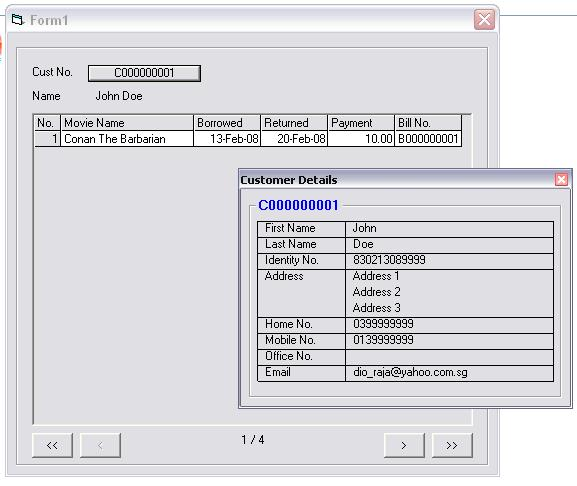



## A Simple MSHFlexgrid Example

### Description

For beginners to understand how to use the MSHFlexgrid... My code will populate records from a database to a MSHFlexgrid...
 
### More Info
 
Make sure not to delete the "Log" folder...

Else the code will crash upon running as i didn't complete it yet... just for learning purpose...

No side effects at all...

             |
---                |---
**Submitted On**   |2008-09-22 03:40:02
**By**             |[N\. Arasaraajah](https://github.com/Planet-Source-Code/PSCIndex/blob/master/ByAuthor/n-arasaraajah.md)
**Level**          |Intermediate
**User Rating**    |4.0 (8 globes from 2 users)
**Compatibility**  |VB 6\.0
**Category**       |[Databases/ Data Access/ DAO/ ADO](https://github.com/Planet-Source-Code/PSCIndex/blob/master/ByCategory/databases-data-access-dao-ado__1-6.md)
**World**          |[Visual Basic](https://github.com/Planet-Source-Code/PSCIndex/blob/master/ByWorld/visual-basic.md)
**Archive File**   |[A\_Simple\_M2127789222008\.zip](https://github.com/Planet-Source-Code/n-arasaraajah-a-simple-mshflexgrid-example__1-71109/archive/master.zip)

